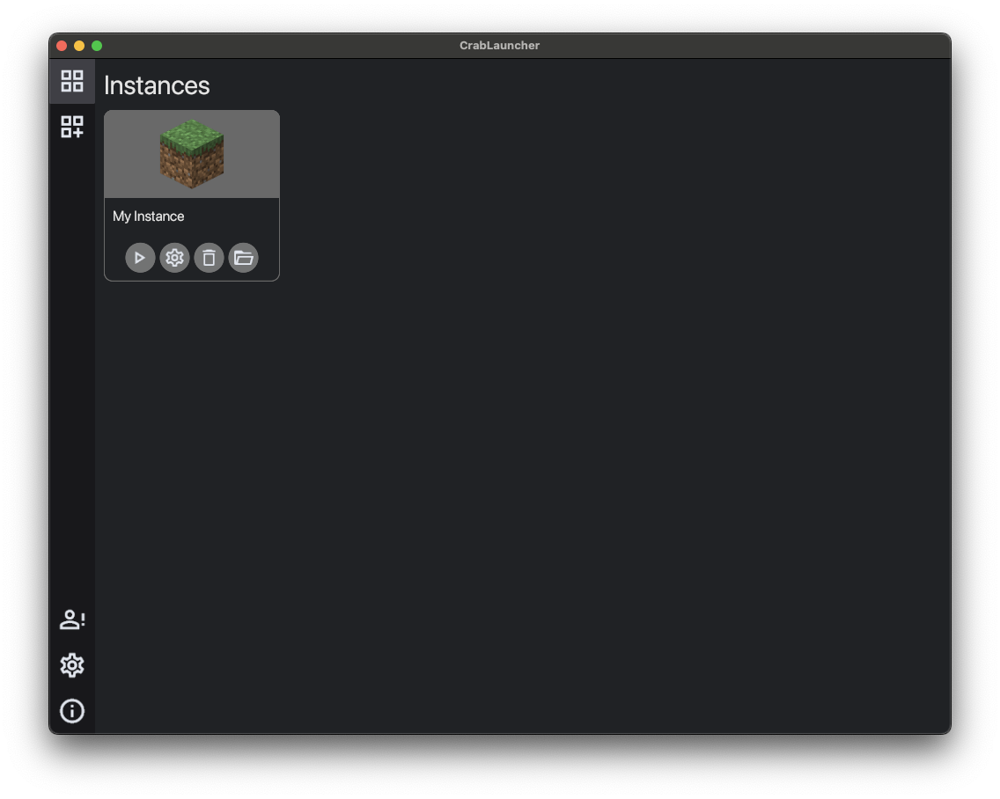

<br>

<p align="center">

</p>

<h1 align="center">Icy Launcher</h1>

<p align="center">
<a href="https://github.com/mq1/icy-launcher/releases/latest"></a>
<a href="https://github.com/mq1/icy-launcher/blob/main/LICENSE"></a>
</p>



-----

An unofficial WIP launcher for Minecraft 1.19+

As of now, this launcher is considered a technical preview and every release breaks everything from the previous install

**Table of Contents**

- [Installation](#installation)
- [Thanks](#thanks)
- [License](#license)

## Installation

### Package (recommended)

Just grab the [latest release](https://github.com/mq1/icy-launcher/releases/latest) for your platform

### From source

```sh
git clone https://github.com/mq1/icy-launcher.git
cd icy-launcher
cargo build --release
```

## Thanks

- Aru for the logo
- Héctor Ramón for [iced](https://github.com/iced-rs/iced)
- The [Material Design Icons](https://github.com/Templarian/MaterialDesign) community
- [Crafatar](https://crafatar.com/)

## License

`icy-launcher` is distributed under the terms of the [GPL-3.0-only](https://spdx.org/licenses/GPL-3.0-only.html) license.

### Licenses

- [Inter](https://github.com/rsms/inter) | [OFL-1.1](https://github.com/rsms/inter/blob/master/LICENSE.txt)
- [Material Icons](https://github.com/google/material-design-icons) | [Apache-2.0](https://github.com/google/material-design-icons/blob/master/LICENSE)
